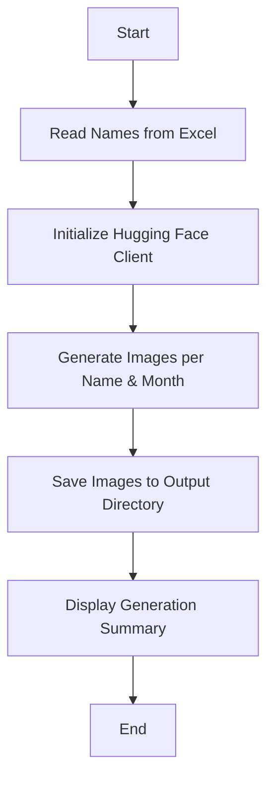

# 🖼️ Personalized Image Generator

## Overview

Personalized Image Generator is an innovative Streamlit application that creates stunning, seasonally-themed landscape images with personalized names integrated organically into the natural environment.

## 🌟 Key Features

- **Personalized Image Creation**: Generate unique images for multiple names
- **Seasonal Themes**: Crafted landscapes representing each month's distinctive character
- **High-Resolution Output**: Ultra-detailed, cinematic landscape photography
- **Name Integration**: Artistic text incorporation into natural scenes

## 🛠️ Technologies Used

- **Python**: Primary programming language
- **Streamlit**: Web application framework
- **Hugging Face**: AI-powered image generation
- **Pandas**: Excel file processing

## 📦 Prerequisites

### System Requirements
- Python 3.8+
- Hugging Face Account
- Excel with Names Column

### Required Libraries
- `streamlit`
- `pandas`
- `huggingface_hub`

## 🚀 Installation

1. Clone the repository:
   ```bash
   git clone https://github.com/yourusername/personalized-image-generator.git
   ```

2. Install dependencies:
   ```bash
   pip install -r requirements.txt
   ```

## 🔧 Configuration

### Prepare Your Excel File
- Create an Excel spreadsheet
- Add a column named "Names"
- Populate with desired names

### Hugging Face Token
Obtain an API token from [Hugging Face](https://huggingface.co/) for image generation.

## 💡 Usage

1. Run the Streamlit app:
   ```bash
   streamlit run app.py
   ```

2. In the web interface:
   - Enter Hugging Face Token
   - Upload Names Excel File
   - Choose Output Directory
   - Click "Generate Images"

## 🌈 Seasonal Themes

| Month | Theme Description |
|-------|-------------------|
| January | Snowy Scandinavian forests with aurora borealis |
| February | Soft winter landscapes with gentle snow |
| March | Japanese cherry blossom gardens |
| ... | (Other months detailed similarly) |

## 🔍 Image Generation Process



## 🛡️ Error Handling

- Robust retry mechanism for image generation
- Comprehensive error logging
- User-friendly error notifications

## 📊 Performance Considerations

- Exponential backoff for API calls
- Memory management with garbage collection
- Progress tracking and status updates

## 🤝 Contributing

1. Fork the repository
2. Create your feature branch (`git checkout -b feature/AmazingFeature`)
3. Commit your changes (`git commit -m 'Add some AmazingFeature'`)
4. Push to the branch (`git push origin feature/AmazingFeature`)
5. Open a Pull Request

## 📜 License

Distributed under the MIT License. See `LICENSE` for more information.

## 📞 Contact

Your Name - [Your Email]

Project Link: [https://github.com/yourusername/personalized-image-generator](https://github.com/yourusername/personalized-image-generator)

## 🙏 Acknowledgements

- [Streamlit](https://streamlit.io/)
- [Hugging Face](https://huggingface.co/)
- [Black Forest Labs](https://www.blackforestlabs.ai/)

---

**Happy Image Generating! 🎨✨**
